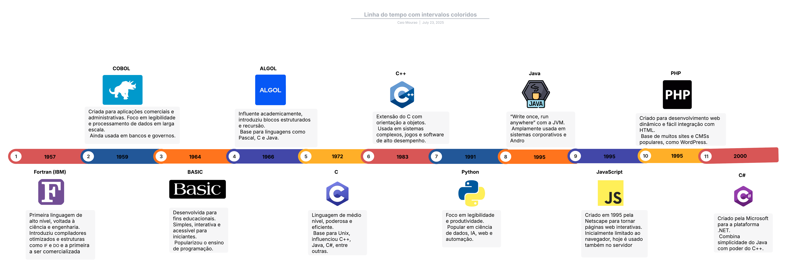

# 01 - Introdução às Linguagens de Programação

Este desafio tem como objetivo apresentar uma visão histórica da evolução das linguagens de programação. A linha do tempo a seguir destaca os principais marcos no desenvolvimento dessas linguagens, contextualizando o surgimento de cada uma dentro de seu tempo e necessidade tecnológica.

## 🕰️ Linha do Tempo da Programação

> **Autor:** Caio Mourão  

---

## 🧭 Panorama Histórico

Desde os primórdios da computação, a criação de linguagens de programação esteve ligada à busca por **abstrações mais compreensíveis**, **automatização de processos** e **acesso ampliado ao poder de cálculo das máquinas**.

Abaixo, apresentamos os marcos históricos mais relevantes:

---

### 🟣 1957 – **Fortran (IBM)**  
- **Contexto:** Em plena Guerra Fria, havia uma demanda crescente por cálculos científicos e engenharia avançada.
- **História:**
  - Desenvolvida por uma equipe da IBM liderada por John Backus.
  - Considerada a **primeira linguagem de programação de alto nível**.
  - Facilitou o trabalho de engenheiros e cientistas ao substituir a linguagem de máquina por uma notação mais próxima da matemática.
- **Importância:**  
  Tornou o uso de computadores mais acessível em universidades e centros de pesquisa.

---

### 🔵 1959 – **COBOL**  
- **Contexto:** Expansão do uso de computadores no setor comercial e governamental.
- **História:**
  - Criada por um comitê liderado por Grace Hopper, com apoio do Departamento de Defesa dos EUA.
  - Desenvolvida para permitir que **pessoas não técnicas pudessem ler e entender o código**.
- **Importância:**  
  Sua clareza sintática foi pioneira e influenciou os sistemas administrativos que ainda hoje usam COBOL em instituições financeiras e públicas.

---

### ⚫ 1964 – **BASIC**  
- **Contexto:** Popularização dos computadores em universidades.
- **História:**
  - Criada por John Kemeny e Thomas Kurtz no Dartmouth College.
  - Voltada para o **ensino da programação a estudantes de qualquer área**.
- **Importância:**  
  Democratizou o acesso à programação e teve papel crucial nos primeiros computadores pessoais.

---

### 🔷 1966 – **ALGOL**  
- **Contexto:** Necessidade de padronização de algoritmos entre cientistas europeus e americanos.
- **História:**
  - Desenvolvida por um comitê internacional.
  - Introduziu estruturas de controle mais organizadas (blocos begin/end) e **foi a primeira linguagem a utilizar notação BNF** para sua definição.
- **Importância:**  
  Considerada a “mãe” de muitas linguagens modernas, teve forte influência acadêmica e conceitual.

---

### 🟠 1972 – **C**  
- **Contexto:** Desenvolvimento do sistema operacional UNIX nos laboratórios Bell.
- **História:**
  - Criada por Dennis Ritchie para substituir o Assembly no desenvolvimento do UNIX.
  - Oferecia portabilidade entre diferentes máquinas, algo revolucionário na época.
- **Importância:**  
  A linguagem C foi o ponto de partida para muitas outras, como C++, Java e C#. É usada até hoje em sistemas embarcados, drivers e sistemas operacionais.

---

### 🔵 1983 – **C++**  
- **Contexto:** Avanço da engenharia de software e da programação orientada a objetos (POO).
- **História:**
  - Desenvolvida por Bjarne Stroustrup como uma extensão orientada a objetos da linguagem C.
- **Importância:**  
  Popularizou o uso da orientação a objetos em softwares complexos e aplicações de alto desempenho como jogos e sistemas bancários.

---

### 🟡 1991 – **Python**  
- **Contexto:** Necessidade de uma linguagem simples e legível para desenvolvimento rápido.
- **História:**
  - Criada por Guido van Rossum na Holanda.
  - Inspirada em ABC, C e Modula-3, com o objetivo de tornar a programação mais intuitiva.
- **Importância:**  
  Python se tornou uma das linguagens mais populares do mundo, sendo a base de aplicações em **ciência de dados, inteligência artificial, web e automação**.

---

### ☕ 1995 – **Java**  
- **Contexto:** Popularização da internet e dos sistemas distribuídos.
- **História:**
  - Desenvolvida pela Sun Microsystems com o lema **"Write once, run anywhere"**, devido ao uso da **Java Virtual Machine (JVM)**.
- **Importância:**  
  Tornou-se padrão em aplicações corporativas, bancárias, sistemas embarcados e, futuramente, no desenvolvimento de apps Android.

---

### 🟨 1995 – **JavaScript**  
- **Contexto:** Explosão da web nos anos 1990 e necessidade de páginas mais interativas.
- **História:**
  - Criado por Brendan Eich na Netscape em apenas 10 dias.
  - Inicialmente visto como linguagem de "brincadeira", ganhou força com a Web 2.0 e frameworks modernos.
- **Importância:**  
  Atualmente é a linguagem central do desenvolvimento web, com forte presença também no backend graças ao Node.js.

---

### ⚫ 1995 – **PHP**  
- **Contexto:** Construção dinâmica de páginas web.
- **História:**
  - Criado por Rasmus Lerdorf para monitorar acessos ao seu site pessoal.
  - Evoluiu rapidamente para permitir **a criação dinâmica de páginas HTML com dados de banco**.
- **Importância:**  
  Ainda hoje movimenta sites e sistemas como WordPress, Wikipedia e Facebook (em seus primórdios).

---

### 🟣 2000 – **C#**  
- **Contexto:** Consolidação da plataforma .NET pela Microsoft.
- **História:**
  - Criada por Anders Hejlsberg como uma linguagem moderna, segura e poderosa para o desenvolvimento de aplicações Windows.
- **Importância:**  
  Base do ecossistema .NET, usada para aplicativos desktop, APIs, aplicações web e desenvolvimento de jogos com Unity.

---

## 🧠 Conclusão

O surgimento e a evolução das linguagens de programação refletem as necessidades tecnológicas de cada época. De ferramentas científicas e comerciais a soluções para a internet e a inteligência artificial, essas linguagens moldaram não apenas o desenvolvimento de software, mas o próprio avanço da sociedade digital.
