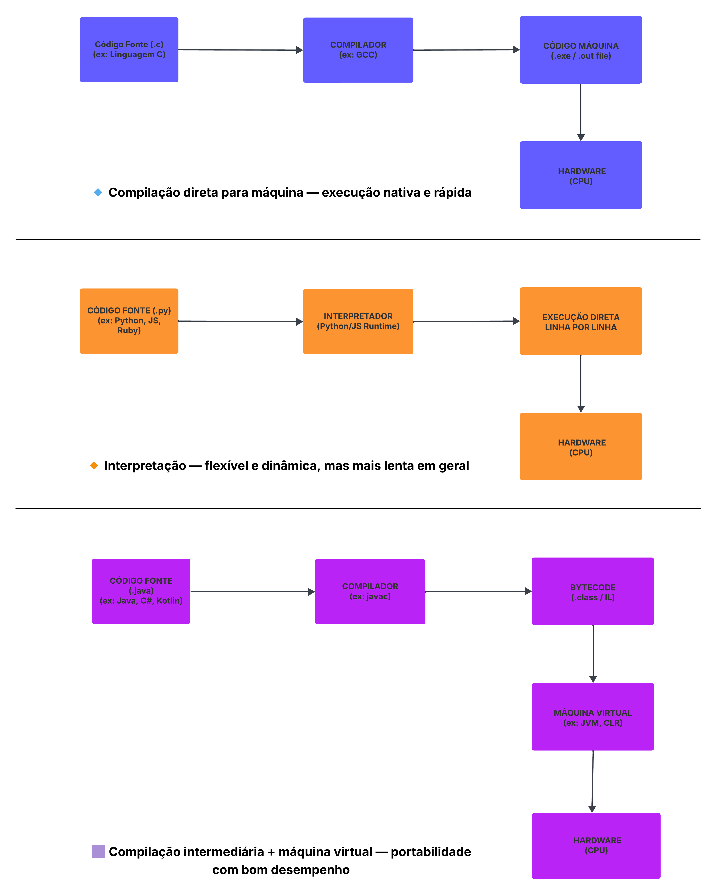

# 02 - Ambientes de Programação

Este desafio tem como objetivo apresentar e comparar os **três principais modelos de execução de programas** usados nas linguagens de programação: compilação direta, interpretação e compilação com máquina virtual. A imagem abaixo resume visualmente esses modelos.

---

## 🧭 Mapa Conceitual

> **Autor:** Caio Mourão  

---

## 🧱 Tipos de Ambientes de Execução

### 🔹 1. Compilação Direta para Código de Máquina

- **Exemplo de linguagem:** C
- **Processo:**
  - O código-fonte (.c) é traduzido por um **compilador** (como GCC) diretamente para **código de máquina** executável (.exe, .out).
- **Vantagens:**
  - Execução rápida e eficiente (acesso direto ao hardware).
- **Desvantagens:**
  - Menor portabilidade: o executável é específico para um sistema operacional/arquitetura.

---

### 🟧 2. Interpretação

- **Exemplos de linguagens:** Python, JavaScript, Ruby
- **Processo:**
  - O **interpretador** lê o código-fonte (.py, .js) e o executa **linha por linha**, sem gerar um arquivo binário intermediário.
- **Vantagens:**
  - Grande flexibilidade, excelente para scripts, testes e prototipação.
- **Desvantagens:**
  - Mais lenta, pois o código é analisado em tempo de execução.

---

### 🟪 3. Compilação Intermediária com Máquina Virtual

- **Exemplos de linguagens:** Java, C#, Kotlin
- **Processo:**
  - O código-fonte é compilado em **bytecode** (intermediário, não executável diretamente).
  - Esse bytecode é executado por uma **máquina virtual** (JVM, CLR), que traduz para instruções de máquina em tempo de execução.
- **Vantagens:**
  - Alta **portabilidade** (roda em qualquer sistema com a máquina virtual adequada).
  - Equilíbrio entre **desempenho** e **abstração**.
- **Desvantagens:**
  - Necessita da máquina virtual instalada.

---

## 🧠 Conclusão

Cada abordagem de execução surgiu para atender diferentes necessidades tecnológicas e contextos históricos. A escolha entre compilação, interpretação ou uso de máquina virtual depende de fatores como desempenho, portabilidade, segurança e tipo de aplicação.

---

## 📂 Arquivos

- Mapa-conceitual.png: imagem contendo o mapa visual dos tipos de ambientes de execução (Lucidcharto).

